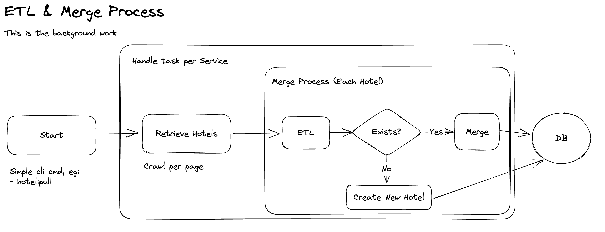
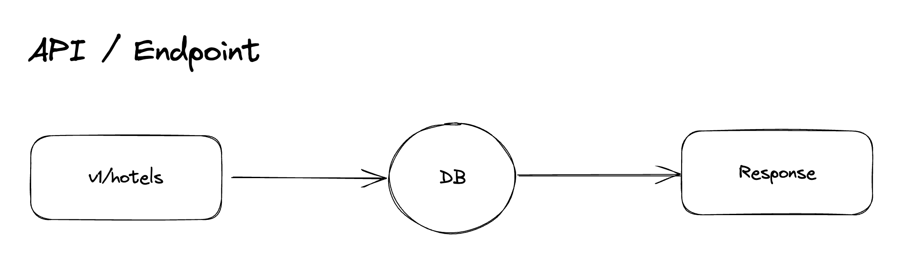

# The Aurelion Sol Project

The Aurelion Sol Project is a simple ETL service to:

- Retrieve the hotels from multiple sources and merging them if duplicated.
- Transform and persist them into the structured data
- Simple endpoint to get the hotels (with filtering & sorting)

Created by [Seth Phat](https://github.com/sethsandaru)

## STACK
- PHP 8.2
- Laravel 10
- SQLite

## Diagram

### ETL

### API

## Supported Services

FYA I named them with some fancy name, easier to maintain & remember 😛

- RainyService: http://www.mocky.io/v2/5ebbea002e000054009f3ffc
- SunnyService: http://www.mocky.io/v2/5ebbea102e000029009f3fff
- WindyService: http://www.mocky.io/v2/5ebbea1f2e00002b009f4000

## Getting Started

TBA

## Data Decision

### Trim on retrieval

Every time the system extracts the data from 3rd-party, always `trim($string)` before setting it.

This would help us to clear the starting & ending spaces of a string (and some other special characters).

### Always Null Coalesce

If the `column` is `null` and the given value is not, automatically apply the value to the column.

### Greedy on long-string-column

If you know SEO, people always says this: "Content is King". The longer content, the better SEO & ranking.

So for example, if the current description field is shorter than the given value, apply the new value to the description column.

### Merge & Unique for Options

For those columns which contains multiple options, ensure the options are "unique" when merging.

Also, if the option are partially matching, it will be considered as "duplicated", eg:

- Input: "indoor pool", "pool" => "pool" is duplicated and will be filtered out.

## Tests

I love test & TDD. This project is covered by Unit Tests & Integration Tests.

Apologies for adding more Unit Test Cases (time), but IRL work, I always ensure my code is fully covered
from Unit to Integration Tests.

## Optimization

- We will retrieve the hotels in "background work". In Request/HTTP layer, we should avoid doing heavy tasks.
  - Additionally, with my good abstraction layers, we can definitely run it via Job Workers (even faster).
- Indexes are added to speed up the DB Query.

## CI
Yes, simple CI test flow using GitHub Action, with Coverage Report.

## CD

Coming soon

## Live Demo

Coming soon

## Copyright

Copyright ©️2023 by Seth Phat. All right reserved!
